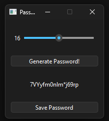

# 🔐 Simple Password Generator (GUI)

A lightweight and beginner friendly **password generator** built using **Python + PySide6**.  
This tool allows you to generate secure passwords using a slider to choose the length, view the result instantly, and save the generated password to a file.

---

## 🚀 Features

- 🎨 **Simple PySide6 GUI**
- 🔢 **Adjustable password length** via slider
- 🔁 **Instant password generation**
- 💾 **Save generated password** to `password.txt`
- ⚡ Lightweight & beginner-friendly
- 📦 Clean project structure with virtual environment

---


## 🖼 GUI Preview



---

## 🔧 Installation

### 1️⃣ Clone the repository
```bash
git clone https://github.com/iloveTheRain/Simple-Password-generator-gui
```

```bash
cd Simple-Password-generator-gui/src
```
```bash
pip install -r requirements.txt
```
